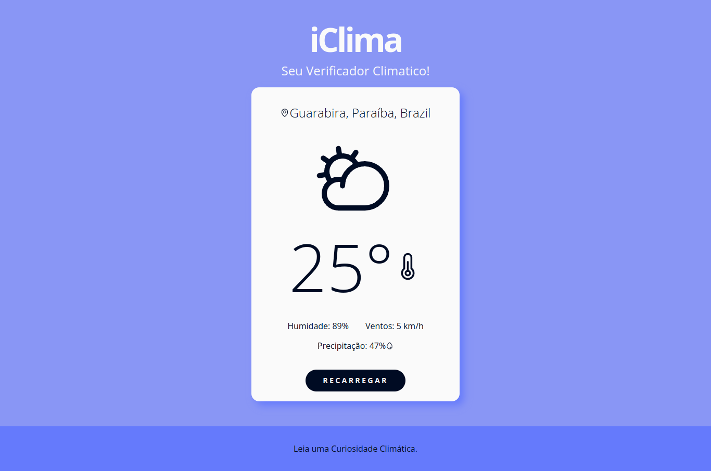

# Desafio-Time-Builders

## iClima
Batizada de iClima minha aplicação que utiliza a localização do usuário para exibir informações climáticas e do endereço atual.

## Screen

## Funcionalidades
* Utiliza a API OpenWeatherMap para obter informações climáticas da região.
* Exibe o endereço atual do usuário e as informações climáticas em uma interface amigável.
* Permite atualizar os dados.
* Contém uma pagina de curiosidades climáticas visando descontração e retenção do usuário na pagina.

## Tecnologias Utilizadas
* React
* Typescript
* React Router DOM
* Axios
* OpenWeatherMap API
* Geolocation API
* React Phosphor Icons
* Styled Components

## Como Utilizar
1. Clone o repositório.
2. Instale as dependências utilizando o comando npm install.
3. Inicie a aplicação com o comando npm run dev.
4. Clique no Localhost exibido.
5. Pronto!

## Acesse
Caso prefira acessar online clique aqui:https://iclima.vercel.app/
